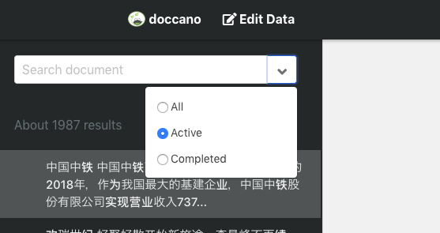
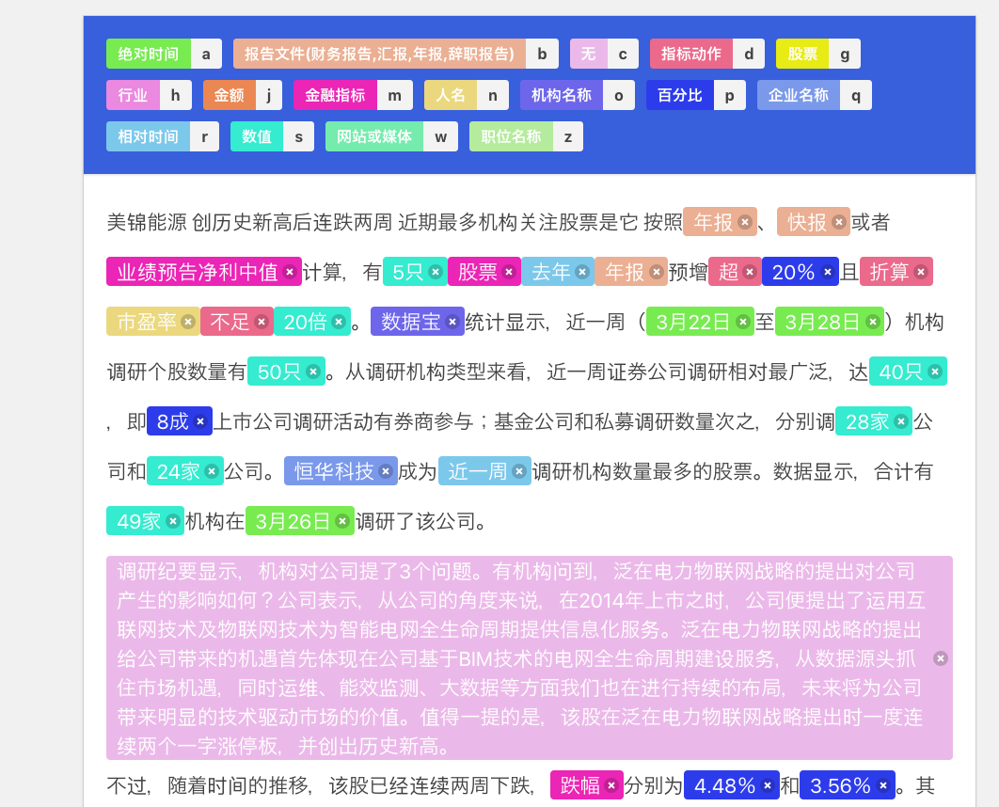
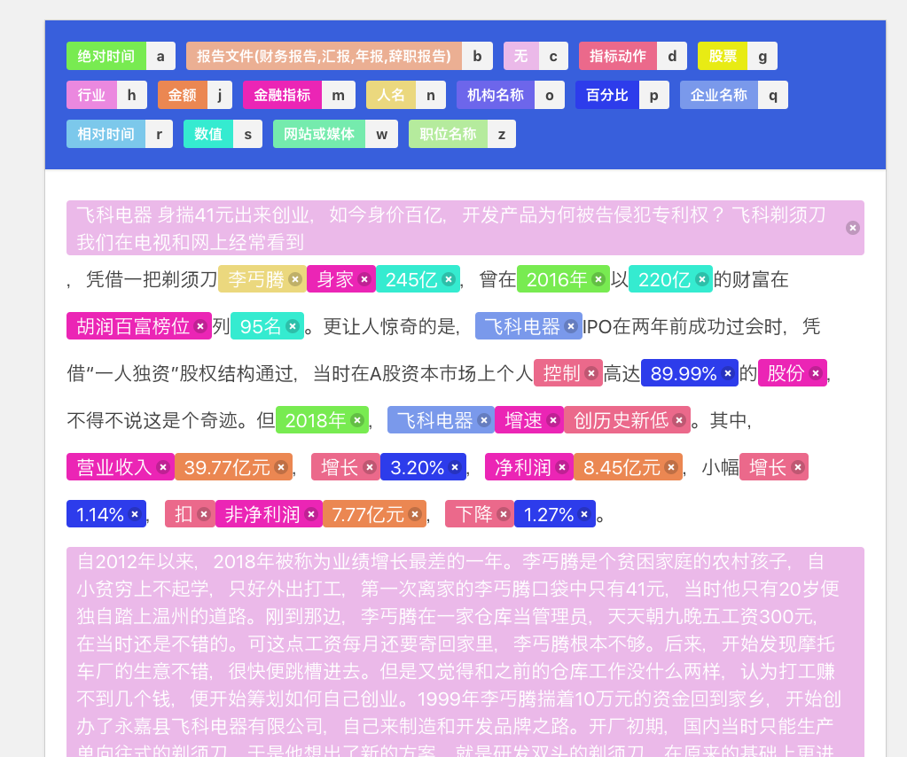

# SmoothNLP 标注

## 注意 
> 每次标注请筛选 **Active** 下的标注样本

_____

## 标签说明
| 标签名称  | 快捷键 |  描述 | 样例 | 
| ------- | ----- | ----- | ---- |
| 企业名称 | **q** (企业) | 公司/集团, 或公众认知的企业下大型品牌(*华为-荣耀*) | 小米金融/万达集团/广汽 |
| 相对时间 | **r** (Relative Time) | 相对时间, 需要一个坐标时间才能定位具体时间 | 上月, 下季度, 去年, 今年4月 | 
| 绝对时间 | **a** (Absolute Time) | 绝对时间, 能准确定位时间 | 2018年, 2018年4季度 | 
| 金融指标 | **m** (metric) | 金融指标, *注意*: 这个概念可能比较抽象, **任何可以被描述的金融对象都算 ** | 市值,估值,利润率,**股份** | 
| 指标动作 |  **d** (动作) | 一切描述指标变化的动作(动词) | 达到, 提升, 环比增长, 增持 | 
| 股票 | **g** (股票) | 股票名称或代码 | SZ0001 |
| 行业 | **h** (行业) | 行业名称 | 银行业, 金融业, 工业
| 金额 | **j** (金额) | 
| 数值 | **s** (数值) | 标注时请注意把量词标注进去 | 一个, 五只, 二十辆 | 
| 百分比 | **p** (percent)| 百分比 | 百分之50, 百分之五十, 50%|
| 网站或媒体 | **w** (website/media) | 
| 职位名称 | **z** (职位) |
| 人名 | **n** (name)  | 
| 报告 | **b** (报告) | 各种金融相关报告 | 财务报告, 年报, 辞职报告 |   
| 无 | **c** (无) | 对于那些你任务*和金融新闻无关* 或者你认为不值得标注, 或者标注过于繁琐的, 可直接标*无* | 如果整段新闻都没有有价值信息, 请全部标"无"

### 标注样例

-----------
